# redikru-test

## Question 1: Infrastructure as Code with Terraform

Preparation: Terraform script is located in "Terraform" directory. In this script, there is a file called "vars.tf"; make sure to fill in the values for "AWS_ACCESS_KEY" and "AWS_SECRET_KEY" with your keys.

Run the following scripts to deploy Terraform:
```
terraform init
terraform plan -out xxx.out (change xxx to any name you prefer)
terraform apply xxx.out
```
Wait until the infrastructure creation process is complete.

This Terraform script will create the following resources:

1. 1 VPC
2. 2 Public Subnets in 2 Availability Zones
3. 1 EC2 instance with Ubuntu 22.04, which has a Security Group with port 22 (SSH) open
4. The EC2 instance can be accessed with a keyfile named redikru.pem (note that redikru.pem is not shared in this case)
5. An S3 Bucket named "fiardika-redikru-test"

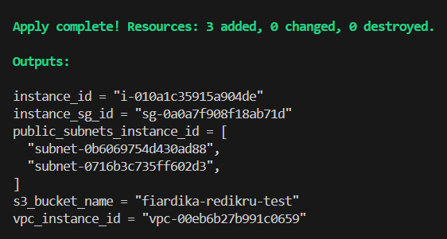
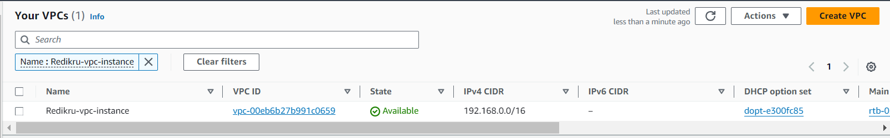
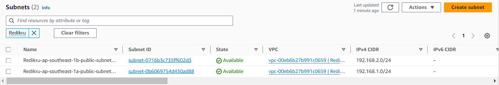
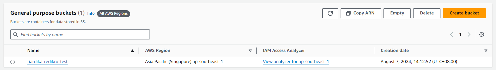
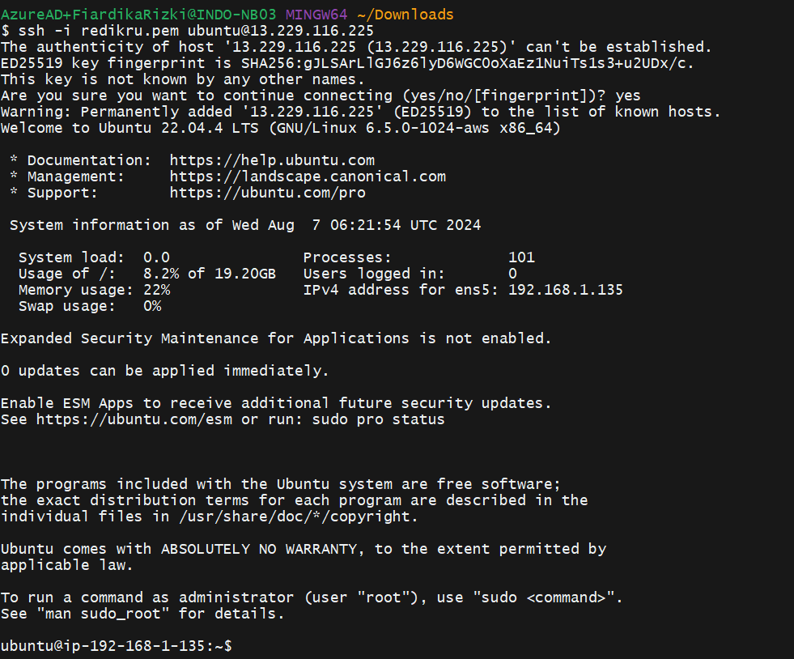
==============================

## Question 2: Continuous Integration/Continuous Deployment with GitHub Actions

Preparation: Web application code is located in "web_app", GitHub Action yaml file for CI/CD located in ".github/workflows".

Note: I'm using Node version 18 LTS with Express.

How to run the app:
1. Go to "web_app" directory
2. Run ```npm install```
3. Run ```node app.js``` or ```npm start```

The app will be running on port 3003
Access on the browser with this url: http://localhost:3003

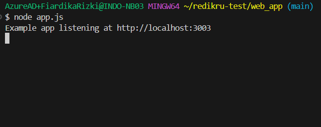
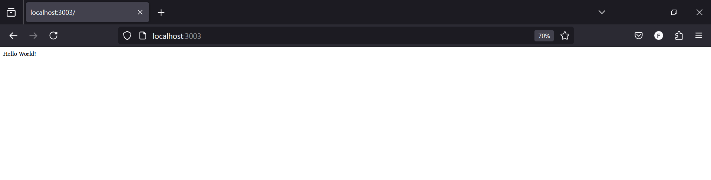

How to run the UT:
1. Go to "web_app" directory
2. Run ```npm install```
3. Run ```npm test```

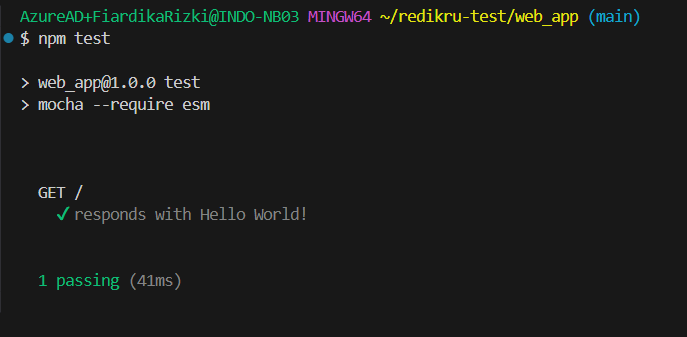

How to run the lint:
1. Go to "web_app" directory
2. Run ```npm install```
3. Run ```npm run lint```

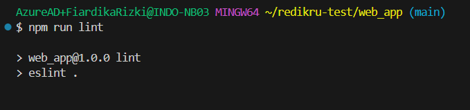

How the CI/CD Works:
1. CI/CD yaml located in .github/workflows/ci-cd.yml.
2. GitHub Actions will run several jobs:
    a. npm install (install dependencies for the app)
    b. npm run lint (lint the code)
    c. npm test (ut the code)
    d. deploy to Heroku
3. Heroku deployment using managed services from Heroku such as:
- uses: actions/checkout@v2 (login to heroku)
- uses: akhileshns/heroku-deploy@v3.13.15 (deploy to heroku)
- buildpack: "https://github.com/heroku/heroku-buildpack-nodejs.git" (buildpack for Node)
- appdir: "web_app" (get the code from web_app directory)

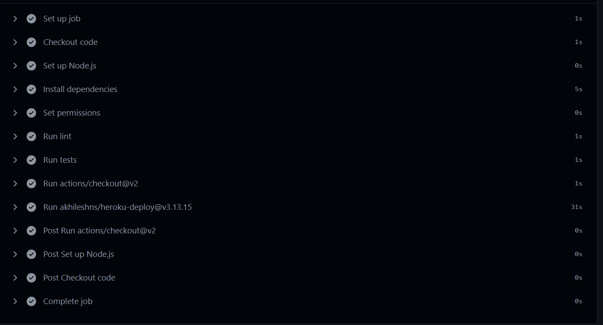

### Deployed Heroku


==============================

## Question 3: Monitoring and Logging with Prometheus and Grafana

Preparation: Web application code is located in "web_app", monitoring tools located in "monitoring".

Docker App
1. Go to "web_app" directory
2. There is Dockerfile that use to build the app as Docker Container
3. Run ```docker build . -t your_app_name:your_tag"```
4. Wait until the build is finished
5. Run the container with this command ```docker run -d -p 3003:3003 your_app_name:your_tag```
6. Access the app on your browser with this url: http://localhost:3003

Grafana and Prometheus
1. Go to "monitoring" directory
2. There is docker-compose.yml, this file contain a script to run Grafana, Prometheus, Node App, CAdvisor, and NodeExporter
3. "prometheus" directory is used to Mount file configuration for Grafana and Prometheus
4. To run all the app, run this command ```docker compose up -d```
5. Grafana, Prometheus, Node App, CAdvisor, and NodeExporter will run

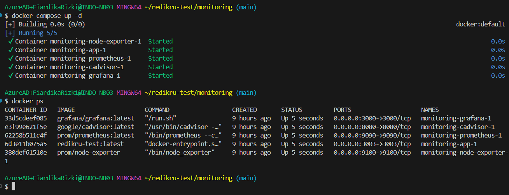

### Monitoring Result

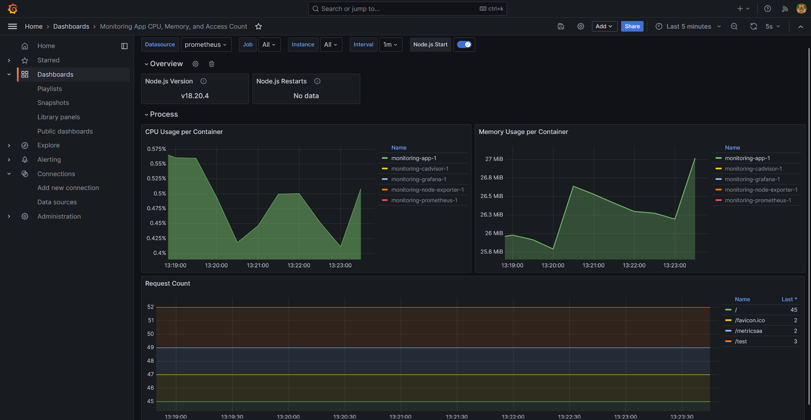